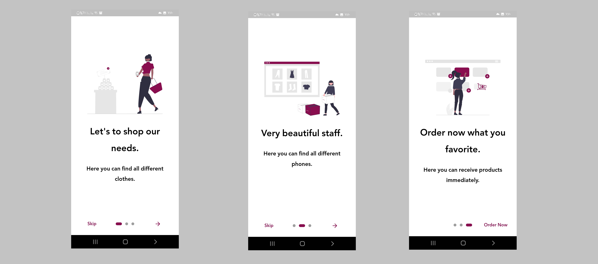
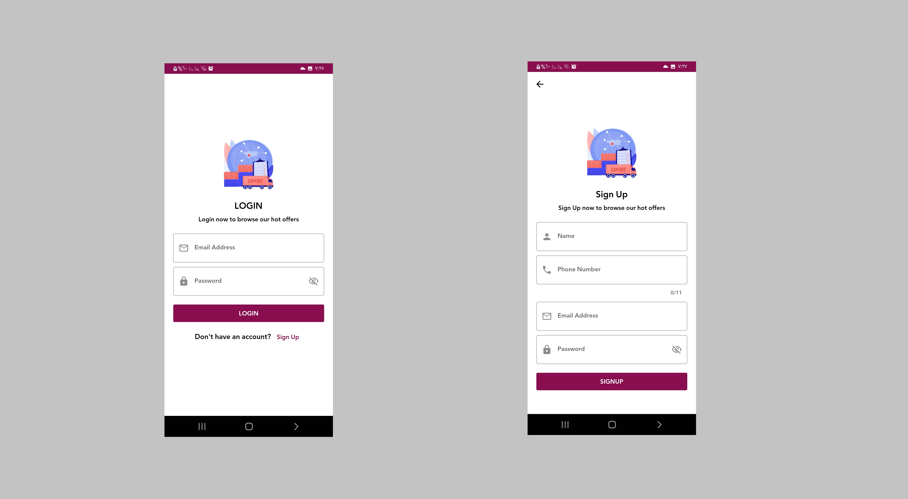
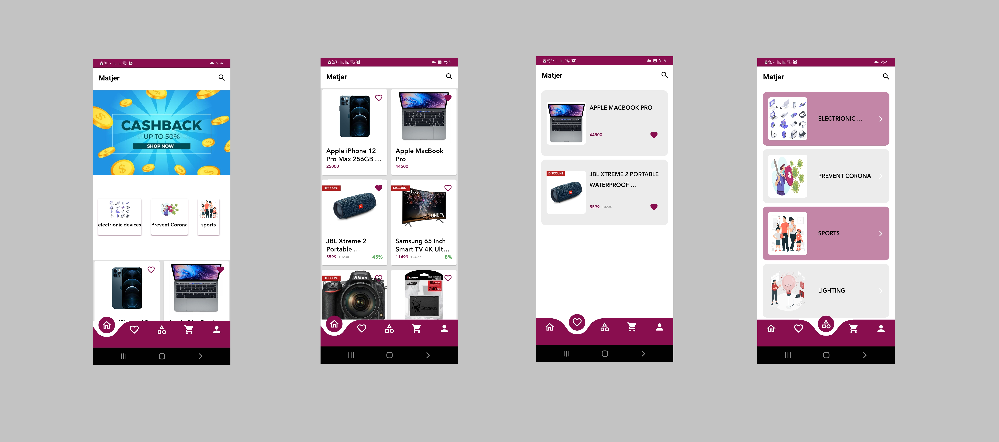
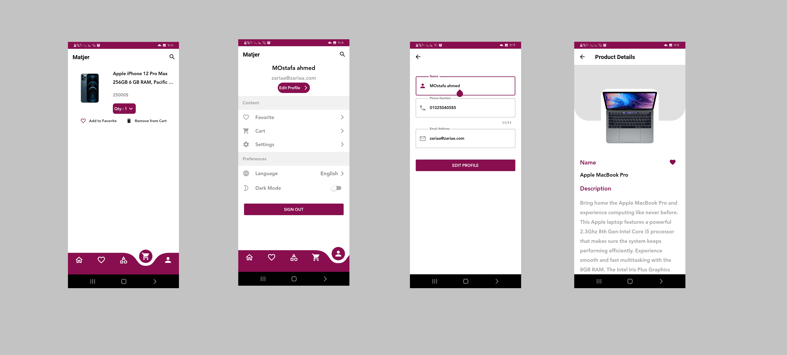
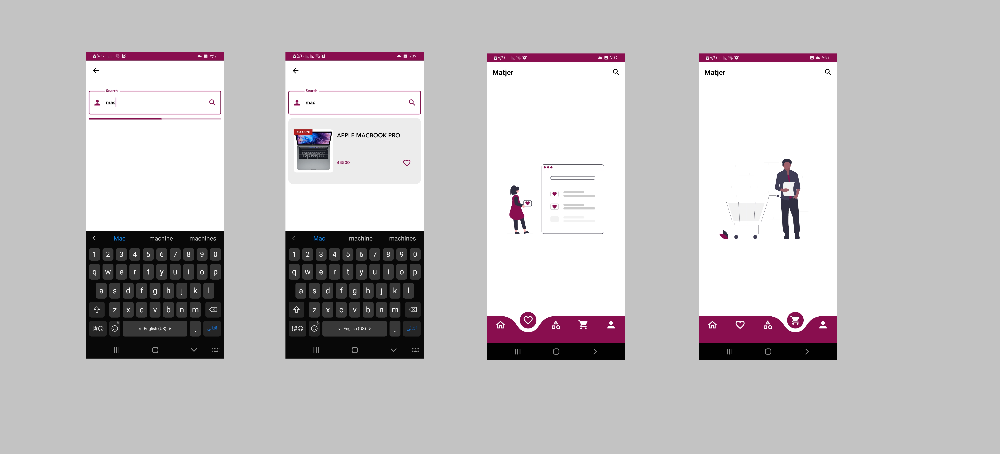

# Matjer - REST API & Bloc

This is an ecommerce app which contain Many features like :
1. Sign in , Sign up , Verify Email , log out.
2. Fetch Products Data
3. Search for any product
4. Add or remove product to  in_favorite & in_cart section
5. Update User data and so on.

Developed using Dart & Flutter & Rest Api & Dio & Bloc & SharedPref.

##Photos from The App

